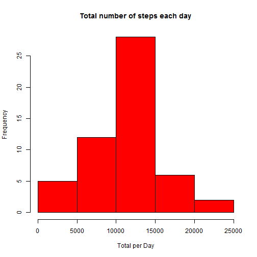
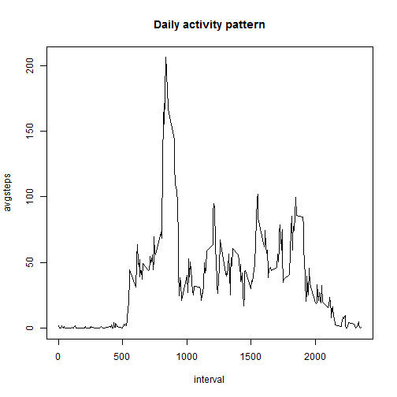
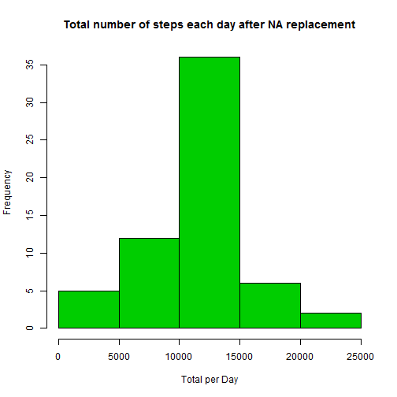
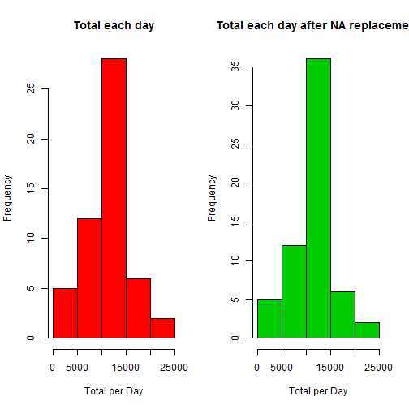
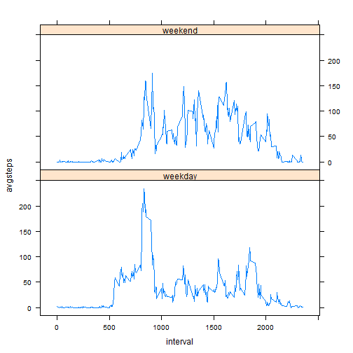

---
title: "Reproducible Research: Peer Assessment 1"
output: 
  html_document:
    keep_md: true

## Loading and preprocessing the data
Prepare to get the days of the week in English, so change the locale to English. Prepare to use the dplyr package and set the working directory where the unzipped data file is saved. Read the data from the file. 

```r
donotreturnthis <- Sys.setlocale("LC_TIME", "English")
library(dplyr)
act <- read.csv("C:/EDS/DSS/RepData/RepData_PeerAssessment1/activity.csv")
act <- tbl_df(act)
act
```

```
## Source: local data frame [17,568 x 3]
## 
##    steps       date interval
##    (int)     (fctr)    (int)
## 1     NA 2012-10-01        0
## 2     NA 2012-10-01        5
## 3     NA 2012-10-01       10
## 4     NA 2012-10-01       15
## 5     NA 2012-10-01       20
## 6     NA 2012-10-01       25
## 7     NA 2012-10-01       30
## 8     NA 2012-10-01       35
## 9     NA 2012-10-01       40
## 10    NA 2012-10-01       45
## ..   ...        ...      ...
```
Each observation contains the number of steps for a given time interval on a given day. Interval with value 25 means 00:25 and so on.

## What is mean total number of steps taken per day?  
1. Calculate the total number of steps per day across all time intervals.

```r
totalAct = act %>% 
        group_by(date) %>%
        summarise(totspd = sum(steps))
```
  
2. Make the histogram of the total number of steps per day.

```r
with(totalAct, hist(totspd, xlab ="Total per Day",col= 2, main = "Total number of steps each day"))
```

 
  
3. Calculate and report the mean and median of the total number of steps taken per day    
Ignoring NA's, the mean total number of steps taken per day is the value of `meanSteps.pdDay`. The median is the value of `medianSteps.pDay`.

```r
totalAct %>% 
        summarise(meanSteps.pDay = mean(totspd, na.rm = T), 
                  medianSteps.pDay = median(totspd, na.rm = T)) %>%
        print.table
```

```
##   meanSteps.pDay medianSteps.pDay 
##         10766.19            10765
```
## What is the average daily activity pattern?  
1. Make a time series plot of the 5-minute interval and the average number of steps taken, averaged across all days.  
First group per 5-minute interval over all days, then calculate the average of the number of steps per time interval over the grouped data. Ignore the NA's when calculating the average to get the pattern.  


```r
dayAct = act %>% 
        group_by(interval) %>%
        summarise(avgsteps = mean(steps, na.rm = T)) 
```
Then, create the time series plot with `type = "l"` of the 5-minute interval (x-axis) and the average number of steps taken, averaged across all days (y-axis).

```r
with(dayAct, plot(interval,avgsteps, type = "l", main = "Daily activity pattern"))
```

 
  
2. Which 5-minute interval, on average across all the days in the dataset, contains the maximum number of steps?

Find the interval with the maximum steps across all days. We find the interval in the middle of the morning rush 08:35.  

```r
dayAct %>% top_n(1, avgsteps) %>% print        
```

```
## Source: local data frame [1 x 2]
## 
##   interval avgsteps
##      (int)    (dbl)
## 1      835 206.1698
```
  
  
## Imputing missing values
  
1. Calculate and report the total number of missing values in the dataset (i.e. the total number of rows with NAs).  

Summary returns the number of NA's, alternatively calculation can also be done with summarise.

```r
summary(act)
```

```
##      steps                date          interval     
##  Min.   :  0.00   2012-10-01:  288   Min.   :   0.0  
##  1st Qu.:  0.00   2012-10-02:  288   1st Qu.: 588.8  
##  Median :  0.00   2012-10-03:  288   Median :1177.5  
##  Mean   : 37.38   2012-10-04:  288   Mean   :1177.5  
##  3rd Qu.: 12.00   2012-10-05:  288   3rd Qu.:1766.2  
##  Max.   :806.00   2012-10-06:  288   Max.   :2355.0  
##  NA's   :2304     (Other)   :15840
```

```r
actNa = act %>%
        summarise(naTotal = sum(as.numeric(is.na(steps)))) %>%
        print
```

```
## Source: local data frame [1 x 1]
## 
##   naTotal
##     (dbl)
## 1    2304
```
  
2. Devise a strategy for filling in all of the missing values in the dataset. The strategy does not need to be sophisticated.  
Strategy chosen is to replace all missing values by the mean for the same time interval averaged over all days. For the code to implement this strategy see below.  

3. Create a new dataset that is equal to the original dataset but with the missing data filled in.  
Join the avgsteps from the daily activity table to the orginal data. Store this in the new dataset `act2`.

```r
act2 <- left_join(act,dayAct,by="interval")
```
This creates a new variable in ```act2``` named ```avgstep```. Now replace the value of ```steps``` with ```avgsteps``` for all observations where steps is NA else keep ```steps```. Then drop the ```avgsteps``` variable.

```r
act2$steps<-ifelse(is.na(act2$steps),act2$avgsteps, act2$steps)
act2 <- select(act2, -avgsteps)
```
All NA's are now replaced by the average steps for that interval. `act2` does not contain any NA's anymore as opposed to the orginal `act`.

```r
summary(act2)
```

```
##      steps                date          interval     
##  Min.   :  0.00   2012-10-01:  288   Min.   :   0.0  
##  1st Qu.:  0.00   2012-10-02:  288   1st Qu.: 588.8  
##  Median :  0.00   2012-10-03:  288   Median :1177.5  
##  Mean   : 37.38   2012-10-04:  288   Mean   :1177.5  
##  3rd Qu.: 27.00   2012-10-05:  288   3rd Qu.:1766.2  
##  Max.   :806.00   2012-10-06:  288   Max.   :2355.0  
##                   (Other)   :15840
```

```r
summary(act)
```

```
##      steps                date          interval     
##  Min.   :  0.00   2012-10-01:  288   Min.   :   0.0  
##  1st Qu.:  0.00   2012-10-02:  288   1st Qu.: 588.8  
##  Median :  0.00   2012-10-03:  288   Median :1177.5  
##  Mean   : 37.38   2012-10-04:  288   Mean   :1177.5  
##  3rd Qu.: 12.00   2012-10-05:  288   3rd Qu.:1766.2  
##  Max.   :806.00   2012-10-06:  288   Max.   :2355.0  
##  NA's   :2304     (Other)   :15840
```
  
4. Make a histogram of the total number of steps taken each day and calculate and report the mean and median total number of steps taken per day.   
Make the histogram:

```r
totalAct2 = act2 %>% 
        group_by(date) %>%
        summarise(totspd = sum(steps))
with(totalAct2, hist(totspd, xlab ="Total per Day",col= 3, main = "Total number of steps each day after NA replacement"))
```

 
  
Calculate and report the mean and median total number of steps taken per day with the replaced NAs. 

```r
totalAct2 %>% 
        summarise(meanSteps.pDay.na.rm = mean(totspd), 
                  medianSteps.pDay.na.rm = median(totspd)) %>%
        print.table
```

```
##   meanSteps.pDay.na.rm medianSteps.pDay.na.rm 
##               10766.19               10766.19
```

Do these values differ from the estimates from the first part of the assignment?  
In the first part we found:

```r
totalAct %>% 
        summarise(meanSteps.pDay = mean(totspd, na.rm = T), 
                  medianSteps.pDay = median(totspd, na.rm = T)) %>%
        print.table
```

```
##   meanSteps.pDay medianSteps.pDay 
##         10766.19            10765
```
So, the replacement of the NA's by the average per interval across all days has no significant impact on the mean/median of the total steps per day. 

What is the impact of imputing missing data on the estimates of the total daily number of steps?  
No significant impact on the mean of the total per day but the grand total of steps over all days was significantly increased by replacing the NAs.

```r
GrandTotal = sum(act$steps, na.rm =T)
GrandTotal.na.rm = sum(act2$steps)
TotalStepsAdded = GrandTotal.na.rm - GrandTotal
PCTAdded = TotalStepsAdded / GrandTotal * 100
print(TotalStepsAdded)
```

```
## [1] 86129.51
```

```r
print(PCTAdded)
```

```
## [1] 15.09434
```
How is this possible? The days with NA values are completely NA over all intervals i.e. over all ```24 * (60/5) = 288 ``` intervals of the day. Indeed either all intervals of a given day are NA or none:   

```r
actNa = act %>%
        group_by(date) %>%
        summarise(naPerDay = sum(as.numeric(is.na(steps)))) 
unique(actNa$naPerDay)
```

```
## [1] 288   0
```
  
Given this data, the chosen strategy reduces the standard deviation but does not affect the mean.

```r
sd(totalAct$totspd, na.rm = T)
```

```
## [1] 4269.18
```

```r
sd(totalAct2$totspd)
```

```
## [1] 3974.391
```

```r
mean(totalAct$totspd, na.rm = T)
```

```
## [1] 10766.19
```

```r
mean(totalAct2$totspd)
```

```
## [1] 10766.19
```
Comparing the two histograms confirms this:

```r
par(mfrow = c(1, 2))
with(totalAct, hist(totspd, xlab ="Total per Day",col= 2, main = "Total each day"))
with(totalAct2, hist(totspd, xlab ="Total per Day",col= 3, main = "Total each day after NA replacement"))
```

 
   
## Are there differences in activity patterns between weekdays and weekends?

1. Create a new factor variable in the dataset with two levels – “weekday” and “weekend” indicating whether a given date is a weekday or weekend day.  
Creating the new variable by calculating the name of the corresponding date and then assigning the requested factor level.  

```r
act <- mutate(act, weekday = ifelse((weekdays(as.Date(date)) %in% 
              c("Sunday","Saturday")),"weekend", "weekday"))
act$weekday <- as.factor(act$weekday)
```
Group the data per interval and type of day (weekend or weekday) and take the mean per interval across all days ignoring the NAs.

```r
dayActWD = act %>% 
        group_by(interval,weekday) %>%
        summarise(avgsteps = mean(steps, na.rm = T))  
```
2. Make a panel plot containing a time series plot (i.e. type = "l") of the 5-minute interval (x-axis) and the average number of steps taken, averaged across all weekday days or weekend days (y-axis).  
Preparing the plot:

```r
library(lattice)
xyplot(avgsteps ~ interval | weekday, data = dayActWD, type = "l", layout = c(1, 2))
```

 
  
Conclusion:  
The weekend pattern differs from the week pattern. Subjects seem to make steps evenly throughout the day in the weekend whereas in the week there is a higher amount of steps in the morning, probably when going to work or school.
